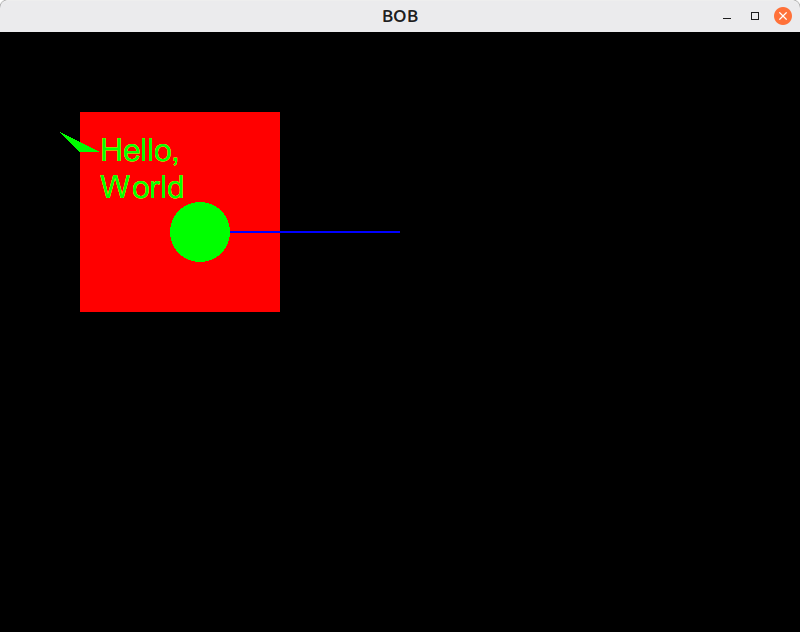

# BOB: A batched 2D Renderer for OpenGL and Vulkan

### Features  
 - OpenGL and Vulkan backends  
 - Batched rendering to ensure fewer draw calls per frame to improve performance  
 - Static memory usage means no memory allocations during rendering  
 - Bitmap font rendering API alongside a built-in BMFont parser  
 - Support for rendering primitives: lines, quads, polys  
 - Rect clipping  
 - Texture atlas generation  
 - Pixelbuffers so you can stream pixel data directly to a texture on the GPU  
 - Assign layers to draw calls to determine draw order  
 - Built-in default shaders so you can easily get started

**N.B.** This library is still in early development, and there are still plenty of features to be added, optimisations to be made, and bugs to be fixed (as can be seen by the large number of TODOs scattered throughout the code).

## Getting Started  
If using the OpenGL backend, define BOB_INCLUDE_GLAD and BOB_IMPLEMENTATION in one file before adding bob.h and add [glad.h](https://gen.glad.sh/) to your include path  
If using the Vulkan backend, define BOB_INCLUDE_VULKAN and BOB_IMPLEMENTATION in one file before adding bob.h and add the [Vulkan SDK](https://vulkan.lunarg.com/sdk/home) (at least version 1.3) to your include path  

```C
#define BOB_IMPLEMENTATION
#define BOB_INCLUDE_VULKAN //NOTE: You can include both the OpenGL and Vulkan backends at the same time, but GLFW only supports having one active at a time
#include "../bob.h"
#include <GLFW/glfw3.h> //Using GLFW as our windowing library of choice, but any libary that supports OpenGL and Vulkan will do
#define STB_IMAGE_IMPLEMENTATION
#include "stb_image.h" //So that we can load the font texture
#include <sys/time.h>

GLFWwindow *window;
BOB_Renderer_Handle r;

//GLFW callback for when the window is resized
//Updates the width and height in the renderer so that the projection matrix
//(and the objects being rendered) can be adjusted to fit the new screen size
void framebuffer_size_callback(GLFWwindow* window, int width, int height) {
    //Update viewport dimensions
    #ifdef BOB_INCLUDE_GLAD
    glViewport(0, 0, width, height);
    #endif
    int width_scr, height_scr;
    glfwGetWindowSize(window, &width_scr, &height_scr);
    BOB_renderer_update_dimensions(r, width_scr, height_scr, width, height);
}

//Callback function used by the Vulkan backend to create the swapchain surface
#ifdef BOB_INCLUDE_VULKAN
uint8_t create_window_surface(VkInstance instance, VkSurfaceKHR *surface) {
    if(glfwCreateWindowSurface(instance, window, NULL, surface)){
        printf("Failed to create window surface\n");
        return 0;
    }
    return 1;
}
#endif

//Function that initialises GLFW and your given backend
int init(GLFWwindow **window) {
    //Initialising GLFW:
    glfwInit();

    //OpenGL Backend
    #ifdef BOB_INCLUDE_GLAD
    glfwWindowHint(GLFW_CONTEXT_VERSION_MAJOR, 3);
    glfwWindowHint(GLFW_CONTEXT_VERSION_MINOR, 3);
    glfwWindowHint(GLFW_OPENGL_PROFILE, GLFW_OPENGL_CORE_PROFILE);
    glfwWindowHint(GLFW_DEPTH_BITS, 24); //Necessary for enabling the depth buffer

    #ifdef __APPLE__
        glfwWindowHint(GLFW_OPENGL_FORWARD_COMPAT, GL_TRUE);
    #endif

    *window = glfwCreateWindow(800, 600, "BOB", NULL, NULL);

    if(*window == NULL) {
        printf("Failed to create GLFW window\n");
        glfwTerminate();
        return 0;
    }

    //Setting callback functions
    glfwMakeContextCurrent(*window);
    glfwSetFramebufferSizeCallback(*window, framebuffer_size_callback);

    //Loading Glad and initialising BOB
    if(!BOB_init((GLADloadproc)glfwGetProcAddress, 1)) {
        glfwTerminate();
        return 0;
    }

    //Creating the renderer we are going to use
    if(!BOB_create_opengl_renderer(BOB_MAX_ATLAS_CAPACITY, BOB_MAX_PIXELBUFFER_CAPACITY, BOB_MAX_TEX_CAPACITY, BOB_MAX_MATERIAL_CAPACITY, BOB_MAX_FONT_CAPACITY,
                                   800, 600, BOB_MAX_VERTEX_CAPACITY, BOB_MAX_INDEX_CAPACITY, BOB_MAX_DRAW_CALL_CAPACITY, &r)) {
        glfwTerminate();
        return 0;
    }
    #endif

    //Vulkan backend
    #ifdef BOB_INCLUDE_VULKAN
    glfwWindowHint(GLFW_CLIENT_API, GLFW_NO_API); //Set to NO_API so that it uses Vulkan instead of OpenGL
    *window = glfwCreateWindow(800, 600, "BOB", NULL, NULL);

    if(*window == NULL) {
        printf("Failed to create GLFW window\n");
        glfwTerminate();
        return 0;
    }

    //Setting callback functions
    glfwMakeContextCurrent(*window);
    glfwSetFramebufferSizeCallback(*window, framebuffer_size_callback);

    //Get the required vulkan extensions from GLFW
    uint32_t glfw_extension_count = 0;
    const char **glfwExtensions = glfwGetRequiredInstanceExtensions(&glfw_extension_count);
    if(glfwExtensions == NULL) {
        printf("Failed to get required GLFW extensions\n");
        return 0;
    }

    //Creating a Vulkan instance and initialising BOB
    if(!BOB_init(glfwExtensions, glfw_extension_count, 1)) {
        glfwTerminate();
        return 0;
    }

    //Creating the Vulkan renderer
    int width, height;
    glfwGetFramebufferSize(*window, &width, &height);
    if(!BOB_create_vulkan_renderer(BOB_MAX_ATLAS_CAPACITY, BOB_MAX_PIXELBUFFER_CAPACITY, BOB_MAX_TEX_CAPACITY, BOB_MAX_MATERIAL_CAPACITY, BOB_MAX_FONT_CAPACITY,
                                  800, 600, width, height, BOB_MAX_VERTEX_CAPACITY, BOB_MAX_INDEX_CAPACITY, BOB_MAX_DRAW_CALL_CAPACITY, &create_window_surface, &r)) {
        glfwTerminate();
        return 0;
    }
    #endif

    return 1;
}

//Loads our font texture
uint32_t load_tex(char *path, BOB_Font_Handle font) {
    int width, height, nrChannels;
    unsigned char *data = stbi_load(path, &width, &height, &nrChannels, 0);
    if (data) {
        BOB_Format format;
        //Converting the number of channels into the required format
        switch (nrChannels) {
            case 1: format = BOB_RED; break;
            case 2: format = BOB_RG; break;
            case 3: format = BOB_RGB; break;
            case 4: format = BOB_RGBA; break;
        }

        // *tex = BOB_create_texture(width, height, data, format);
        BOB_add_font_page(font, width, height, data, format);
    }
    else {
        fprintf(stderr, "Failed to load texture at path %s\n", path);
        return 0;
    }
    stbi_image_free(data);

    return 1;
}


int main(void) {
    if(init(&window)) {
        //Loading our font data
        BOB_Font_Handle font;
        int8_t res = BOB_load_bmf_font(r, "../test.fnt", &font, BOB_BMF_TEXT);
        if(res <= 0) BOB_print_parsing_error();
        load_tex("../test.png", font); //Loading the font image

        while(!glfwWindowShouldClose(window)) {

            //Clear the screen and begin rendering
            BOB_renderer_begin(r, (float[4]){0.0f, 0.0f, 0.0f, 0.0f});
                //Draw some primitives
                BOB_draw_quad(r, (BOB_Quad){80, 80, 200, 200}, (BOB_Vector4){1.0, 0.0, 0.0, 1.0}, 100.0, 0.0);
                BOB_draw_circle(r, (BOB_Vector2){200, 200}, 30, (BOB_Vector4){0.0, 1.0, 0.0, 1.0}, 101.0);
                BOB_draw_line(r, (BOB_Vector2){200, 200}, (BOB_Vector2){400, 200}, 2.0, (BOB_Vector4){0.0, 0.0, 1.0, 1.0}, 100.0);
                BOB_draw_polygon(r, (BOB_Vector2[3]){(BOB_Vector2){60.0f, 100.0f}, (BOB_Vector2){80.0f, 120.0f}, (BOB_Vector2){100.0f, 120.0f}}, 3, (BOB_Vector4){0.0f, 1.0f, 0.0f, 1.0f}, 100.0, 0.0);

                //Print Hello, World on the screen
                BOB_Vector2 pos = (BOB_Vector2){100, 100};
                if(!BOB_draw_char_string(font, "Hello,\nWorld", 12, &pos, (BOB_Vector4){0.0, 1.0, 0.0, 1.0}, 1000)) printf("Invalid Codepoint\n");
            BOB_renderer_end(r); //Submit our draw calls to the GPU

            glfwSwapBuffers(window);
            glfwPollEvents();
        }
    }

    BOB_terminate();
    glfwTerminate();
}
```

The above code will output something like the following:  


## Summary

* [General Concepts](#general-concepts)
    * [Initialising BOB](#initialising-bob)
    * [Creating Objects](#creating-objects)
    * [The Render Loop](#the-render-loop)
    * [Rendering Primitives](#rendering-primitives)
    * [Rendering Textures](#rendering-textures)
    * [Rendering Fonts](#rendering-fonts)
    * [Streaming data to a pixelbuffer](#streaming-data-to-a-pixelbuffer)
    * [Adding images to an atlas](#adding-images-to-an-atlas)
    * [Specifying a Clip Rect](#specifying-a-clip-rect)
    * [Loading a BMFont](#loading-a-bmfont)
    * [Creating a font from a different Bitmap font format](#creating-a-font-from-a-different-bitmap-font-format)
    * [Creating custom shaders](#creating-custom-shaders)
    * [Setting custom values to constants](#setting-custom-values-to-constants)
 * [API](#api)
    * [Conventions](#conventions)
    * [Initalising BOB](#initialising-bob)
    * [Renderer](#renderer)
    * [Texture](#texture)
    * [Atlas](#atlas)
    * [Pixelbuffer](#pixelbuffer)
    * [Font](#font)
    * [Shader Data](#shader-data)
    * [Uniform](#uniform)
    * [Material](#material)
    * [Clipping](#clipping)
    * [Mathematical](#mathematical)

## General Concepts
### Initialising BOB
BOB must be initialised by call BOB_init, specifying the GLADloadproc if using the OpenGL backend or the required Vulkan extensions if using the Vulkan backend. You must also specify the number of renderers your program expects to use so that BOB can accurately allocate memory.
### Creating Objects
The first thing to do after initialising BOB is to create a BOB_Renderer. You should have one BOB_Renderer per application window. The BOB_Render handles drawing operations as well as managing the objects created with that renderer. As with most BOB objects, BOB_Renderers are accessed using handles, both to remove the burdern of object management away from the end user and into the library and to prevent undue modification of object data. Objects created using one BOB_Renderer cannot be used by another, the program will throw an error.
### The Render Loop
Draw calls should be made between the BOB_renderer_begin() and BOB_renderer_end() functions
```C
BOB_renderer_begin(r, (float[4]){0.0f, 0.0f, 0.0f, 0.0f});
    BOB_draw_quad(r, (BOB_Quad){80, 80, 200, 200}, (BOB_Vector4){1.0, 0.0, 0.0, 1.0}, 100.0, 0.0);
    BOB_draw_circle(r, (BOB_Vector2){200, 200}, 30, (BOB_Vector4){0.0, 1.0, 0.0, 1.0}, 101.0);
    BOB_draw_texture(texture, (BOB_Quad){300, 300, 50, 50}, (BOB_Quad){0, 0, 1, 1}, (BOB_Vector4){1.0, 1.0, 1.0, 1.0}, 200, 0.0);
    ...
BOB_renderer_end();
```
The second argument of BOB_renderer_begin() is the colour the screen should be cleared to. If you don't want the screen's colour to be cleared, set it to NULL.  
When drawing primitives the renderer must be specified, but when drawing from an object this is not necessary as its handle contains data on the BOB_Renderer that owns it.  
This loop does not guarantee that only one draw call will be made in a frame, as the renderer could be flushed several times between BOB_renderer_begin() and BOB_renderer_end(), BOB_renderer_end() just indicates that it is time to submit the current swapchain image to be presented to the screen.  
Almost all draw functions in BOB will as for a colour and a layer as an input. The colour specifies the tint you want the final image to have, if you don't want a tint, set it to ```(BOB_Vector4){1.0f, 1.0f, 1.0f, 1.0f}``` (white). The layer determines which elements will be drawn on top and which on the bottom, with larger values being drawn at the top and lower ones at the bottom. You can currently specify layer values between 0 and BOB_MAX_LAYER (1024). If you need more layers, see [Setting custom values to constants](#setting-custom-values-to-constants) on how to change this.
**N.B.** Due to how BOB handles batching, BOB only guarantees that draw calls that share the same material and texture will be drawn in the order they were made, otherwise there is no guarantee that draw calls to the same layer using different materials/textures will be drawn in the order they were made. If you need a specific order between your draw calls, use layers.
### Rendering Primitives
Primitives (lines, quads and polys) can be renderered from a specific BOB_Renderer. When created, each BOB_Renderer creates a small one pixel white texture which it uses as a base to draw primitives from, along side a default material is used to render textures and primitives when no other material is specified. All primitives (except lines) can be rendered either filled or unfilled. When rendering a filled polygon, there is a limit on the number of verticies you can use as specified by BOB_MAX_POLY_SIZE (see the section on [setting custom values](#setting-custom-values-to-constants) on how to change this value) which is currently set to 256. This is due to BOB statically allocating memory to be used when triangulating the polygon so it can be renderered. Unfilled polygons do not need to be triangulated and as such do not have this constraint.  
### Rendering Textures
When rendering a texture from an image, atlas, or pixelbuffer you can specify the screen dimensions of the texture as well as the subregion of the texture you would like to use. The subregion must be specified in texture coordinates, not normalised uv coordinates, it is normalised inside the function.
### Rendering Fonts
When rendering a string from a font you should use BOB_draw_char_string() (for ASCII strings) or BOB_draw_codepoint_string() (for Unicode strings). BOB also provides BOB_draw_codepoint() which can be used to render a single (ASCII or Unicode) character. All of these functions require a pointer to a BOB_Vector2, which should contain the start position you want BOB to start drawing from. As BOB draws the string, it will update the values stored in this pointer so that it eventually shows the final position after rendering. BOB also provides the utility functions BOB_measure_char_string() and BOB_measure_codepoint_string() that return the dimensions of the regions the rendered string will occupy.
### Streaming data to a pixelbuffer
BOB_Pixelbuffers represent textures that have their pixel data continuously updated, and as such they function as textures for rendering, but have their own functions for streaming data to and from themselves. This would look something like the following:
```C
void *mapped_mem_ptr;
size_t mapped_mem_sz;
//Bind memory, getting a pointer to the mapped region and its size as output
BOB_bind_pixelbuffer_memory(pb, &mapped_mem_ptr, &mapped_mem_sz);
    /* Pixelbuffer Operations */
    ...

BOB_unbind_pixelbuffer_memory(pb); //Unbind the memory so the GPU source is updated
BOB_pixelbuffer_upload(pb); //Stream the final data to the pixelbuffer's texture
```
Currently the OpenGL backend supports having as many pbos bound as you would like, this is still a developing feature in the Vulkan backend.
### Adding images to an atlas
BOB allows you to build your own texture atlases for efficient batched rendering. This can be done by creating a blank atlas texture using BOB_atlas_init() and then packing it using BOB_atlas_pack(), which returns the sub_rect on the atlas where the new texture data was added.
### Specifying a Clip Rect
BOB supports rect clipping (scissoring). You can begin a new scissor by calling BOB_start_clip() and passing in your clipping region as well as the direction you want the clipping to occur in, which can be ```BOB_CLIP_HORZ``` (horizontal) ```BOB_CLIP_VERT``` (vertical), or ```BOB_CLIP_BOTH``` (both), and end the clipping by calling BOB_end_clip(). Note that clipping applies to all draw calls made between BOB_start_clip() and BOB_end_clip().
### Loading a BMFont
BOB natively supports loading a BMFont using either a text or binary .fnt file (but not xml). Simply call BOB_load_bmf_font with your filepath and specify the .fnt format you are using, BOB_BMF_BINARY for binary .fnt files, and BOB_BMF_TEXT for text .fnt files. Font pages need to be added one by one using BOB_add_font_page(), and should be added in the order of their ids (0 first, then 1, etc).
### Creating a font from a different Bitmap font format
If you would like to create a BOB_Font from a different bitmap format, you'll have to parse the data yourself, but you can easily add it to BOB by first calling BOB_create_custom_font with the number of glyphs and kernings your font contains, and then call BOB_font_append_glyph() or BOB_font_append_kerning() for each glyph/kerning in your font's data. Note that if you append multiple glyphs for the same character or kernings for the same character pairs (e.g. for the same character but of different sizes), BOB overrides the current entry with the latest one added. To support multiple font sizes, you can either have multiple BOB_Fonts which represent the font at different sizes, or have one font which you render at different scalings.
### Creating custom shaders
**N.B.** This feature is currently incomplete and very experimental. It is recommended that you currently use the default shaders instead of defining your own. If you do want to write your own shaders, uniforms should be bound to binding 0, and you can only have one texture, which should be bound to (set = 1, binding = 0)  
BOB allows you to define your own custom shaders and pass them in when creating a material. To do this, you must first create a BOB_Shader_Data object containing the shader code (a string containing the shader text if using the OpenGL backend, or an array of SPIR-V bytecode if using the Vulkan backend), the size of the shader code, the name of the shader's entrypoint, and the type of shader (**NOTE:** If using the Vulkan backend, currently only Vertex and Fragment shaders are supported). This should then be passed to the BOB_create_material function alongside any default uniform values you want to use.
### Setting custom values to constants
BOB uses a number of constants for its internal operations. You can set your own values for them by calling ```#define {$CONSTANT_NAME}``` before including bob.h in one of your files. Below is a list of all the definable constants and their default values:
 - BOB_CIRCLE_LINE_SEGMENTS: 64
 - BOB_MAX_VERTEX_CAPACITY: 1048576
 - BOB_MAX_INDEX_CAPACITY: 2097152
 - BOB_MAX_TEX_CAPACITY: 32
 - BOB_MAX_ATLAS_CAPACITY: 8
 - BOB_MAX_PIXELBUFFER_CAPACITY: 8
 - BOB_MAX_MATERIAL_CAPACITY: 16
 - BOB_MAX_FONT_CAPACITY: 32
 - BOB_MAX_DRAW_CALL_CAPACITY: BOB_MAX_VERTEX_CAPACITY / 3
 - INIT_STACK_CAPACITY: 64
 - BOB_MAX_LAYER: 1024
 - BOB_MAX_SHADERS: 32
 - BOB_MAX_UNIFORMS: 64
 - BOB_MAX_POLY_SIZE: 256

## API
### Conventions
Functions and structs that are part of BOB's public API are prefaced with 'BOB_'  
Functions and structs that are part of BOB's internal API are prefaced with 'BOBi_'  
Functions and structs that are part of BOB's OpenGL backend are prefaced with 'BOBi_gl_'  
Functions and structs that are part of BOB's Vulkan backend are prefaced with 'BOBi_vk_'  

Functions either return ```uint8_t``` or ```void```. The former means that the function can fail (1 means success, 0 means failure), while the latter will always succeed. If a function should produce some value, the last parameter requests a pointer to a variable that should hold that value.

All colours should be submitted as floats in the 0-1 range.
### Intialising BOB
```C
/*
 * Initialses BOB and just the OpenGL backend.
 * @param proc the GLADloadproc required to load Glad
 * @param num_renderers the number of renderers expected to be created
 */
uint8_t BOB_init(GLADloadproc proc, size_t num_renderers);
/*
 * Initialses BOB and just the Vulkan backend.
 * @param required extensions a list of the names of required vulkan extensions
 * @param num_extensions the number of required extensions
 * @param num_renderers the number of renderers expected to be created
 */
uint8_t BOB_init(const char **required_extensions, size_t num_extensions, size_t num_renderers);
//Initialises both the OpenGL and Vulkan backends
uint8_t BOB_init(GLADloadproc proc, const char **required_extensions, size_t num_extensions, size_t num_renderers);
```

### Renderer
```C
/*
 * Creates a renderer that uses the OpenGL backend. Only available if the OpenGL backend is enabled with BOB_INCLUDE_GLAD
 * @param atlas_capacity maximum number of BOB_Atlases this renderer can create
 * @param pixelbuf_capacity maximum number of BOB_Pixelbuffers this renderer can create
 * @param tex_capacity maximum number of BOB_Textures this renderer can create
 * @param mat_capacity maximum number of BOB_Materials this renderer can create
 * @param font_capacity maximum number of BOB_Fonts this renderer can create
 * @param width width of the screen in screen coordinates
 * @param height height of the screen in screen coordinates
 * @param vertex_capacity maximum number of vertices this renderer can store before it has to flush the batch
 * @param index_capacity maximum number of indicies this renderer can store before it has to flush the batch
 * @param draw_call_capacity maximum number of draw calls this renderer can store before it has to flush the batch
 * @param renderer a pointer to a variable that will hold the output handle
 */
uint8_t BOB_create_opengl_renderer(size_t atlas_capacity, size_t pixelbuf_capacity, size_t tex_capacity, size_t mat_capacity, size_t font_capacity,
                                  size_t width, size_t height, size_t vertex_capacity, size_t index_capacity, size_t draw_call_capacity, BOB_Renderer_Handle *renderer);
/*
 * Creates a renderer that uses the OpenGL backend. Only available if the Vulkan backend is enabled with BOB_INCLUDE_VULKAN
 * New parameter info:
 * @param width_px screen width in pixel coordinates (on most systems this will be the same as the width in screen coordinates)
 * @param height_px screen width in pixel coordinates (on most systems this will be the same as the width in screen coordinates)
 * @param surface_func callback function to create a swapchain surface
 */
uint8_t BOB_create_vulkan_renderer(size_t atlas_capacity, size_t pixelbuf_capacity, size_t tex_capacity, size_t mat_capacity,
                            size_t font_capacity, size_t width, size_t height, size_t width_px, size_t height_px, size_t vertex_capacity,
                            size_t index_capacity, size_t draw_call_capacity, BOB_vk_create_surface surface_func, BOB_Renderer_Handle *r);
/*
 * Destroys a renderer and invalidates its handle
 * @param r the handle of the renderer to be destroyed
 */
void BOB_destroy_renderer(BOB_Renderer_Handle *r);

/*
 * Sets up the variables for renderering
 * @param r the handle of the renderer to begin rendering with
 * @param clear_colour the colour the screen should be cleared to. Set to NULL if you don't want the screen to be cleared
 */
void BOB_renderer_begin(BOB_Renderer_Handle r, float clear_colour[4]);
/*
 * Ends rendering to the current frame
 * @param r the handle of the renderer to stop rendering with
 */
void BOB_renderer_end(BOB_Renderer_Handle r);
/*
 * Updates the dimensions of the screen that the renderer renders to. Updates projection matrix
 * @param r the handle of the renderer to stop rendering with
 * @param width width of the screen in screen coordinates
 * @param height height of the screen in screen coordinates
 * @param width_px screen width in pixel coordinates (on most systems this will be the same as the width in screen coordinates)
 * @param height_px screen width in pixel coordinates (on most systems this will be the same as the width in screen coordinates)
 */
void BOB_renderer_update_dimensions(BOB_Renderer_Handle r, uint32_t width, uint32_t height, uint32_t width_px, uint32_t height_px);
```

### Texture
```C
//Possible texture formats in BOB
typedef enum {
    BOB_RED,
    BOB_RG,
    BOB_RGB,
    BOB_RGBA
} BOB_Format;

/*
 * Creates a new texture on the gpu
 * @param r the renderer to use to create this texture
 * @param width the width of the texture
 * @param height the height of the texture
 * @param data the pixel data of the texture
 * @param format the format of the texture
 * @param tex a pointer to a variable that will hold the output texture handle
 */
uint8_t BOB_create_texture(BOB_Renderer_Handle r, uint32_t width, uint32_t height, uint8_t *data, BOB_Format format, BOB_Texture_Handle *tex);

/*
 * Destroys a texture on the GPU and invalidates its handle
 * @param tex a pointer to the handle of the texture to be destroyed
 */
void BOB_texture_free(BOB_Texture_Handle *tex);
```

### Atlas
```C
/*
 * Initialises a blank texture atlas
 * @param r the renderer to use to create the atlas
 * @param width the width of the atlas
 * @param height the height of the atlas
 * @param format the texture format to be used by the atlas
 * @param a a pointer to a variable that will hold the output atlas handle
 */
uint8_t BOB_atlas_init(BOB_Renderer_Handle r, uint32_t width, uint32_t height, BOB_Format format, BOB_Atlas_Handle *a);
/*
 * Packs a new texture into the atlas and returns the UV rect where the texture was placed
 * @param a the handle of the atlas to be used
 * @param pixels the pixel data of the texture to be added
 * @param w the width of the texture to be added
 * @param h the height of the texture to be added
 * @param out_quad a pointer to the variable that will hold the output quad that holds the sub region of the atlas where the new texture was placed
 */
uint8_t BOB_atlas_pack(BOB_Atlas_Handle a, uint8_t* pixels, size_t w, size_t h, BOB_Quad *out_quad);
/*
 * Destroys an atlas and invalidates its handle
 * @param a a pointer to the handle of the atlas to be destroyed
 */
void BOB_atlas_free(BOB_Atlas_Handle *a);
```

### Pixelbuffer
```C
/*
 * Creates a pixel buffer to hold the pixels representing a texture of size width * height
 * @param r the renderer to use to create the pixelbuffer
 * @param width the width of the pixelbuffer texture
 * @param height the height of the pixelbuffer texture
 * @param format the format of the pixelbuffer texture
 * @param pb a pointer to a variable to hold the output pixelbuffer handle
 */
uint8_t BOB_pixelbuffer_init(BOB_Renderer_Handle r, size_t width, size_t height, BOB_Format format, BOB_Pixelbuffer_Handle *pb);
/*
 * Destroys a pixelbuffer and invalidates its handle
 * @param pb a pointer to the handle of the pixelbuffer to be destroyed
 */
void BOB_pixelbuffer_free(BOB_Pixelbuffer_Handle *pb);
//Binds the pixelbuffers gpu memory to cpu memory. Returns a pointer to the mapped cpu region and its size in bytes
uint8_t BOB_bind_pixelbuffer_memory(BOB_Pixelbuffer_Handle pb, void **mapped_mem_ptr, size_t *mem_sz);
//Unbinds the pixelbuffer's gpu memory from cpu space. Must be called before BOB_pixelbuffer_upload
void BOB_unbind_pixelbuffer_memory(BOB_Pixelbuffer_Handle pb);
//Uploads the pixel data from the pixelbuffer into its associated texture
void BOB_pixelbuffer_upload(BOB_Pixelbuffer_Handle pb);
```

### Font
```C
typedef struct {
    uint32_t codepoint; //Unicode codepoint
    BOB_Quad sub_rect; //What region of the page the glyph occupies
    float x_offset, y_offset, x_advance; //Cursor positions before and after drawing this character
    uint8_t page; //Page used to draw this character
    uint8_t channel; //Channel flags
} BOB_Glyph;

typedef struct {
    uint32_t first, second; //Codepoints of the chars involved in the kerning
    float amount; //How much the xpos should be adjusted when drawing the second char immediately following the first
} BOB_Kerning;

/*
 * Creates a BOB_Font for use with a non-BMFont format
 * @param r the renderer to use to create this font
 * @param num_glyphs the number of glyphs used by this font
 * @param num_kernings the number of kernings used by this font
 * @param line_height the height of a single line in this font
 * @param base where to start drawing characters of this font from on a line
 * @param font a pointer to the variable to hold the output font handle
 */
uint8_t BOB_create_custom_font(BOB_Renderer_Handle r, size_t num_glyphs, size_t num_kernings, size_t line_height, size_t base, BOB_Font_Handle *font);
/*
 * Adds a glyph to a font. If a font already contains a glyph with this codepoint, overrides the current data. Should only be used with custom fonts
 * @param font the font handle of the font to add the glyph to
 * @param glyph the glyph data
 */
uint8_t BOB_font_append_glyph(BOB_Font_Handle font, BOB_Glyph glyph);
/*
 * Adds a kerning to a font. If a font already contains a kerning that handles the same characters, overrides the current data. Should only be used with custom fonts
 * @param font the font handle of the font to add the kerning to
 * @param kerning the kerning data
 */
uint8_t BOB_font_append_kerning(BOB_Font_Handle font, BOB_Kerning kerning);
/*
 * Loads a BMFont. The .fnt file must be either in text or binary (NOT XML)
 * @param r the renderer to create this font
 * @param font_path the path to the .fnt file to be loaded
 * @param format the format of the .fnt file. Use BOB_BMF_BINARY for binary files and BOB_BMF_TEXT for text files
 * @param font a pointer to the variable to hold the output font handle
 */
uint8_t BOB_load_bmf_font(BOB_Renderer_Handle r, const char *font_path, BOB_BMF_Format format, BOB_Font_Handle *font);
/*
 * Adds a texture page to a font. The pages must be added in order of id
 * @param font the font handle of the font to add the page to
 * @param page_width the width of the page texture in pixels
 * @param page_height the height of the page texture in pixels
 * @param page_data a buffer containing the page's pixel data
 * @param format the texture format of the page
 */
uint8_t BOB_add_font_page(BOB_Font_Handle font, uint32_t page_width, uint32_t page_height, uint8_t *page_data, BOB_Format page_format);
/*
 * Destroys a font and invalidates its handle
 * @param font a pointer to the handle of the font to be destroyed
 */
uint8_t BOB_font_free(BOB_Font_Handle *font);
/*
 * Draws a single character on the screen
 * @param font the font handle of the font to draw the character with
 * @param codepoint the codepoint of the character to be drawn
 * @param pos a pointer to a BOB_Vector2 holding the start position to begin drawing from. Updated to the position of the cursor after drawing
 * @param colour the tint to draw the character with
 * @param layer the layer (depth) to draw the character on
 */
uint8_t BOB_draw_codepoint(BOB_Font_Handle font, uint32_t codepoint, BOB_Vector2 *pos, BOB_Vector4 colour, uint16_t layer);
/*
 * Draws an ASCII string on the screen
 * @param font the font handle of the font to draw the string with
 * @param str the character string to draw with
 * @param str_len the number of characters in the string
 * @param start a pointer to a BOB_Vector2 holding the start position to begin drawing from. Updated to the position of the cursor after drawing
 * @param colour the tint to draw the character with
 * @param layer the layer (depth) to draw the character on
 */
uint8_t BOB_draw_char_string(BOB_Font_Handle font, char *str, size_t str_len, BOB_Vector2 *start, BOB_Vector4 colour, uint16_t layer);
/*
 * Draws a unicode string on the screen
 * @param font the font handle of the font to draw the string with
 * @param str the character string to draw with
 * @param str_len the number of characters in the string
 * @param start a pointer to a BOB_Vector2 holding the start position to begin drawing from. Updated to the position of the cursor after drawing
 * @param colour the tint to draw the character with
 * @param layer the layer (depth) to draw the character on
 */
uint8_t BOB_draw_codepoint_string(BOB_Font_Handle font, uint32_t *str, size_t str_len, BOB_Vector2 *start, BOB_Vector4 colour, uint16_t layer);
/*
 * Returns the dimensions of the region a given ASCII string would occupy when drawn
 * @param str the character string to draw with
 * @param str_len the number of characters in the string
 * @param font the font handle of the font to measure the string with
 * @param out a pointer to a variable to hold the output dimensions
 */
uint8_t BOB_measure_char_string(char *str, size_t str_len, BOB_Font_Handle font, BOB_Vector2 *out);
/*
 * Returns the dimensions of the region a given Unicode string would occupy when drawn
 * @param str the character string to draw with
 * @param str_len the number of characters in the string
 * @param font the font handle of the font to measure the string with
 * @param out a pointer to a variable to hold the output dimensions
 */
uint8_t BOB_measure_codepoint_string(uint32_t *str, size_t str_len, BOB_Font_Handle font, BOB_Vector2 *out);
//Helper function to print parsing errors
void BOB_print_parsing_error(void);
```

### Shader Data
```C
//Reads the shader data from a file and creates a shader data object
//If using the OpenGL backend, the file must contain text
//If using the Vulkan backend, the file must contain SPIR-V bytecode
uint8_t BOB_create_shader_data(const char * shader_path, const char *entrypoint, BOB_Shader_Type type, BOB_Shader_Data *out);
//Destroys a shader data by freeing the shader code bytes and setting the memory region at the pointer to 0
void BOB_destroy_shader_data(BOB_Shader_Data *data);
```

### Uniform
```C
typedef struct {
    const char *name; //Name of the uniform variable
    //Tagged union representing its value
    union {
        float f;
        uint32_t u32;
        int32_t i32;
        BOB_Vector2 vec2;
        BOB_Vector3 vec3;
        BOB_Vector4 vec4;
        BOB_Mat4 mat4;
        const void *ptr;
    } value;
    BOB_Uniform_Type type;
    BOB_Shader_Type shader_stage; //What stage of the pipeline it occurs in
    uint8_t is_reference; //If the value is a pointer to another value (used if the value is updated frequently)
} BOB_Uniform;

//Macros to quickly define a uniform
#define BOB_uniform_float(u_name, v, stage) (BOB_Uniform){.name = (u_name), .value.f = (v), .type = BOB_UNIFORM_FLOAT, .shader_stage = stage, .is_reference = 0}
#define BOB_uniform_unsigned_int(u_name, v, stage) (BOB_Uniform){.name = (u_name), .value.u32 = (v), .type = BOB_UNIFORM_UNSIGNED_INT, .shader_stage = stage, .is_reference = 0}
#define BOB_uniform_signed_int(u_name, v, stage) (BOB_Uniform){.name = (u_name), .value.i32 = (v), .type = BOB_UNIFORM_SIGNED_INT, .shader_stage = stage, .is_reference = 0}
#define BOB_uniform_vector2(u_name, v, stage) (BOB_Uniform){.name = (u_name), .value.vec2 = (v), .type = BOB_UNIFORM_VEC2, .shader_stage = stage, .is_reference = 0}
#define BOB_uniform_vector3(u_name, v, stage) (BOB_Uniform){.name = (u_name), .value.vec3 = (v), .type = BOB_UNIFORM_VEC3, .shader_stage = stage, .is_reference = 0}
#define BOB_uniform_vector4(u_name, v, stage) (BOB_Uniform){.name = (u_name), .value.vec4 = (v), .type = BOB_UNIFORM_VEC4, .shader_stage = stage, .is_reference = 0}
#define BOB_uniform_mat4(u_name, v, stage) (BOB_Uniform){.name = (u_name), .value.mat4 = (v), .type = BOB_UNIFORM_MAT4, .shader_stage = stage, .is_reference = 0}
#define BOB_uniform_float_ref(u_name, v, stage) (BOB_Uniform){.name = (u_name), .value.ptr = (v), .type = BOB_UNIFORM_FLOAT, .shader_stage = stage, .is_reference = 1}
#define BOB_uniform_unsigned_int_ref(u_name, v, stage) (BOB_Uniform){.name = (u_name), .value.ptr = (v), .type = BOB_UNIFORM_UNSIGNED_INT, .shader_stage = stage, .is_reference = 1}
#define BOB_uniform_signed_int_ref(u_name, v, stage) (BOB_Uniform){.name = (u_name), .value.ptr = (v), .type = BOB_UNIFORM_SIGNED_INT, .shader_stage = stage, .is_reference = 1}
#define BOB_uniform_vector2_ref(u_name, v, stage) (BOB_Uniform){.name = (u_name), .value.ptr = (v), .type = BOB_UNIFORM_VEC2, .shader_stage = stage, .is_reference = 1}
#define BOB_uniform_vector3_ref(u_name, v, stage) (BOB_Uniform){.name = (u_name), .value.ptr = (v), .type = BOB_UNIFORM_VEC3, .shader_stage = stage, .is_reference = 1}
#define BOB_uniform_vector4_ref(u_name, v, stage) (BOB_Uniform){.name = (u_name), .value.ptr = (v), .type = BOB_UNIFORM_VEC4, .shader_stage = stage, .is_reference = 1}
#define BOB_uniform_mat4_ref(u_name, v, stage) (BOB_Uniform){.name = (u_name), .value.ptr = (v), .type = BOB_UNIFORM_MAT4, .shader_stage = stage, .is_reference = 1}

//Returns a uniform handle. NOTE: Handles are always relative to the material, not global, so manage them carefully
//Useful if you need to keep setting a uniform's value.
uint8_t get_uniform(BOB_Material_Handle mat, char *name, BOB_Uniform_Handle *uniform);
```

### Material
```C
/*
 * Creates a new material. Currently materials are just shader programs and uniforms, but they will be expanded in the future
 * @param r the renderer used to create the material
 * @param data the data for the shaders that make up this material's shader program
 * @param num_shaders the number of shaders that make up this material's shader_program
 * @param uniforms the uniforms used by this material
 * @param num_uniforms the number of uniforms used by this material
 * @param mat a pointer to the variable that will hold the output material handle
 */
uint8_t BOB_create_material(BOB_Renderer_Handle r, BOB_Shader_Data *data, size_t num_shaders, BOB_Uniform *uniforms, size_t num_uniforms, BOB_Material_Handle *mat);
/*
 * Destroys a material and invalidates its handle
 * @param mat a pointer to the handle of the material to be destroyed
 */
void BOB_material_free(BOB_Material_Handle *mat);

//Functions to set various types of uniform values
uint8_t BOB_set_material_float(BOB_Material_Handle mat, BOB_Uniform_Handle uniform, float value);
uint8_t BOB_set_material_unsigned_int(BOB_Material_Handle mat, BOB_Uniform_Handle uniform, uint32_t value);
uint8_t BOB_set_material_signed_int(BOB_Material_Handle mat, BOB_Uniform_Handle uniform, int32_t value);
uint8_t BOB_set_material_vector2(BOB_Material_Handle mat, BOB_Uniform_Handle uniform, BOB_Vector2 value);
uint8_t BOB_set_material_vector3(BOB_Material_Handle mat, BOB_Uniform_Handle uniform, BOB_Vector3 value);
uint8_t BOB_set_material_vector4(BOB_Material_Handle mat, BOB_Uniform_Handle uniform, BOB_Vector4 value);
uint8_t BOB_set_material_mat4(BOB_Material_Handle mat, BOB_Uniform_Handle uniform, BOB_Mat4 value);
uint8_t BOB_set_material_float_ref(BOB_Material_Handle mat, BOB_Uniform_Handle uniform, float *value);
uint8_t BOB_set_material_unsigned_int_ref(BOB_Material_Handle mat, BOB_Uniform_Handle uniform, uint32_t *value);
uint8_t BOB_set_material_signed_int_ref(BOB_Material_Handle mat, BOB_Uniform_Handle uniform, int32_t *value);
uint8_t BOB_set_material_vector2_ref(BOB_Material_Handle mat, BOB_Uniform_Handle uniform, BOB_Vector2 *value);
uint8_t BOB_set_material_vector3_ref(BOB_Material_Handle mat, BOB_Uniform_Handle uniform, BOB_Vector3 *value);
uint8_t BOB_set_material_vector4_ref(BOB_Material_Handle mat, BOB_Uniform_Handle uniform, BOB_Vector4 *value);
uint8_t BOB_set_material_mat4_ref(BOB_Material_Handle mat, BOB_Uniform_Handle uniform, BOB_Mat4 *value);
```

### Drawing
**NOTE:** All angles must be in radians. See the [Mathematical](#mathematical) section for a helper to convert from degrees to radians
```C
//Draws a quad
uint8_t BOB_draw_atlas_quad(BOB_Quad dimensions, BOB_Quad sub_rect, BOB_Vector4 colour, BOB_Atlas_Handle atlas, uint16_t layer, float rotation);
//Draws a dynamically allocated texture
uint8_t BOB_draw_texture(BOB_Texture_Handle texture, BOB_Quad dimensions, BOB_Quad sub_rect, BOB_Vector4 colour, uint16_t layer, float rotation);
//Draws a pixel buffer
uint8_t BOB_draw_pixelbuffer(BOB_Pixelbuffer_Handle pb, BOB_Quad dimensions, BOB_Quad sub_rect, BOB_Vector4 colour, uint16_t layer, float rotation);
//Draws a filled circle
uint8_t BOB_draw_circle(BOB_Renderer_Handle r, BOB_Vector2 centre, float radius, BOB_Vector4 colour, uint16_t layer);
//Draws a filled quad
uint8_t BOB_draw_quad(BOB_Renderer_Handle r, BOB_Quad quad, BOB_Vector4 colour, uint16_t layer, float rotation);
//Draws a filled triangle
uint8_t BOB_draw_polygon(BOB_Renderer_Handle r, BOB_Vector2* poly_points, size_t poly_size, BOB_Vector4 colour, uint16_t layer, float rotation);
//Draws an unfilled circle
uint8_t BOB_draw_unfilled_circle(BOB_Renderer_Handle r, BOB_Vector2 centre, float radius, float thickness, BOB_Vector4 colour, uint16_t layer);
//Draws an unfilled quad
uint8_t BOB_draw_unfilled_quad(BOB_Renderer_Handle r, BOB_Quad quad, float thickness, BOB_Vector4 colour, uint16_t layer, float rotation);
//Draws an unfilled triange
uint8_t BOB_draw_unfilled_polygon(BOB_Renderer_Handle r, BOB_Vector2 *poly_points, size_t poly_size, BOB_Vector4 colour, float thickness, uint16_t layer, float rotation);
//Draws a line between two points
uint8_t BOB_draw_line(BOB_Renderer_Handle r, BOB_Vector2 start_pos, BOB_Vector2 end_pos, float thickness, BOB_Vector4 colour, uint16_t layer);

//Draws a quad with a specified material
uint8_t BOB_draw_atlas_quad_mat(BOB_Quad dimensions, BOB_Quad sub_rect, BOB_Vector4 colour, BOB_Atlas_Handle atlas, uint16_t layer, float rotation, BOB_Material_Handle mat);
//Draws a dynamically allocated texture with a specified material
uint8_t BOB_draw_texture_mat(BOB_Texture_Handle texture, BOB_Quad dimensions, BOB_Quad sub_rect, BOB_Vector4 colour, uint16_t layer, float rotation, BOB_Material_Handle mat);
//Draws a pixel buffer with a specified material
uint8_t BOB_draw_pixelbuffer_mat(BOB_Pixelbuffer_Handle pb, BOB_Quad dimensions, BOB_Quad sub_rect, BOB_Vector4 colour, uint16_t layer, float rotation, BOB_Material_Handle mat);
//Draws a filled circle with a specified material
uint8_t BOB_draw_circle_mat(BOB_Renderer_Handle r, BOB_Vector2 centre, float radius, BOB_Vector4 colour, uint16_t layer, BOB_Material_Handle mat);
//Draws a filled quad with a specified material
uint8_t BOB_draw_quad_mat(BOB_Renderer_Handle r, BOB_Quad quad, BOB_Vector4 colour, uint16_t layer, float rotation, BOB_Material_Handle mat);
//Draws a filled triangle with a specified material
uint8_t BOB_draw_polygon_mat(BOB_Renderer_Handle r, BOB_Vector2* poly_points, size_t poly_size, BOB_Vector4 colour, uint16_t layer, float rotation, BOB_Material_Handle mat);
//Draws an unfilled circle with a specified material
uint8_t BOB_draw_unfilled_circle_mat(BOB_Renderer_Handle r, BOB_Vector2 centre, float radius, float thickness, BOB_Vector4 colour, uint16_t layer, BOB_Material_Handle mat);
//Draws an unfilled quad with a specified material
uint8_t BOB_draw_unfilled_quad_mat(BOB_Renderer_Handle r, BOB_Quad quad, float thickness, BOB_Vector4 colour, uint16_t layer, float rotation, BOB_Material_Handle mat);
//Draws an unfilled triange with a specified material
uint8_t BOB_draw_unfilled_polygon_mat(BOB_Renderer_Handle r, BOB_Vector2 *poly_points, size_t poly_size, BOB_Vector4 colour, float thickness, uint16_t layer, float rotation, BOB_Material_Handle mat);
//Draws a line between two points with a specified material
uint8_t BOB_draw_line_mat(BOB_Renderer_Handle r, BOB_Vector2 start_pos, BOB_Vector2 end_pos, float thickness, BOB_Vector4 colour, uint16_t layer, BOB_Material_Handle mat);

//Draws a quad with a specified material
uint8_t BOB_draw_atlas_quad_channel(BOB_Quad dimensions, BOB_Quad sub_rect, BOB_Vector4 colour, BOB_Atlas_Handle atlas, uint16_t layer, float rotation, BOB_Material_Handle mat, uint8_t channel);
//Draws a dynamically allocated texture with a specified material and channel
uint8_t BOB_draw_texture_channel(BOB_Texture_Handle texture, BOB_Quad dimensions, BOB_Quad sub_rect, BOB_Vector4 colour, uint16_t layer, float rotation, BOB_Material_Handle mat, uint8_t channel);
//Draws a pixel buffer with a specified erial and channel
uint8_t BOB_draw_pixelbuffer_channel(BOB_Pixelbuffer_Handle pb, BOB_Quad dimensions, BOB_Quad sub_rect, BOB_Vector4 colour, uint16_t layer, float rotation, BOB_Material_Handle mat, uint8_t channel);
```

### Clipping
```C
//Enum for clipping direction
typedef enum {
    BOB_CLIP_HORZ, //Only clip horizontally
    BOB_CLIP_VERT, //Only clip vertically
    BOB_CLIP_BOTH, //Clip in both directions
} BOB_Clip_Dir;

//Updates the current clipping rect by pushing the intersection of the new clipping region
//with the old clipping regions to the front of the stack but maintains the clipping directions
//specified in the original rect
void BOB_start_clip(BOB_Renderer_Handle r, BOB_Quad rect, BOB_Clip_Dir dir);
//Removes the first clipping intersection from the stack and returns its value
void BOB_end_clip(BOB_Renderer_Handle r);
```

### Mathematical
```C
//Determines the projection matrix for the OpenGL backend
void BOB_ortho_gl(float left, float right, float bottom, float top, float nearZ, float farZ, BOB_Mat4 *dest);
//Determines the projection matrix for the Vulkan backend
void BOB_ortho_vk(float left, float right, float bottom, float top, float nearZ, float farZ, BOB_Mat4 *dest);
//Converts an angle in degrees to radians
float BOB_degrees_to_radians(float angle);
```

